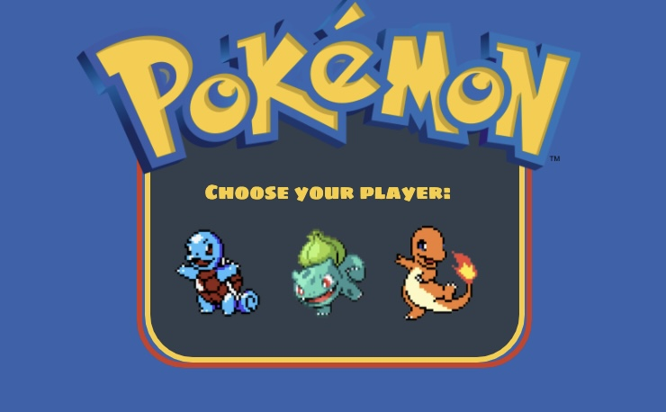
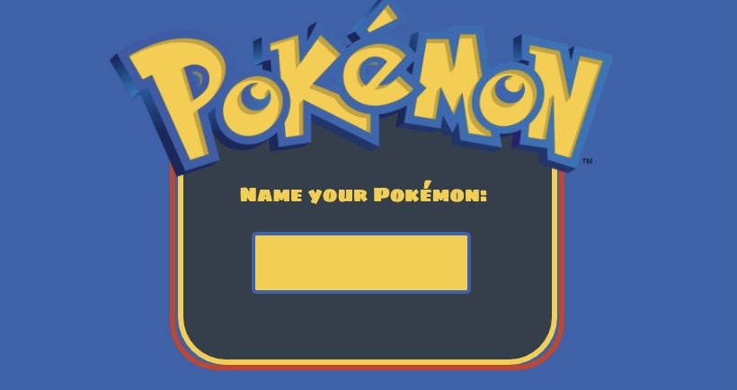
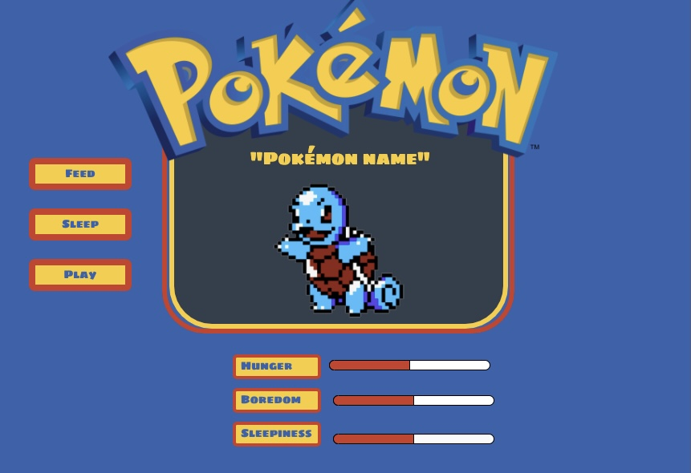

# tamagotchi-game
**Pokémon Tamagatchi!**

*Link to Game:* [Pokémon Tamagatchi!](https://brookecalhoun.github.io/tamagotchi-game/)

//////////////////////////////////////////////////////////////////////////////////

*Wireframe:*

//////////////////////////////////////////////////////////////////////////////////

*User Stories:*
1. A player can choose between the 3 pokemon: squirtle, bulbasaur, and charmander
1. Once chosen, the player can name their pokemon in the input field and press ‘Enter’
1. Their chosen pokemon will make a sound then that pokemon, the chosen pokemon name, and the status numbers/buttons will appear.
1. The hunger, sleepiness, and boredom of the pokemon will increase every 3 seconds, while the age will increase every 8.
1. When ‘feed’ is pressed, the hunger number will decrease & an eating sound will play
1. When ‘sleep’ is pressed, the sleepiness number will decrease & a snore sound will play
1. When ‘play’ is pressed, the boredom bar number decrease & a laugh sound will play
1. Once any of the measures reach 10, the pokemon will turn upside down, a game over sound will play, and a message announcing his death will appear.

//////////////////////////////////////////////////////////////////////////////////

*Explanation:*

This is a game where you can take care of a Pokémon in the same manner as a tamagatchi pet. You can choose between Squirtle, Bulbasaur, and Charmander, and name them 
whatever you want. Once the pet is chosen, you must feed, play with, and put to bed the Pokémon pet before any of his status levels reach 10, because at that point, 
he will die.

//////////////////////////////////////////////////////////////////////////////////

*Installation Instructions:*

No need to install anything- just press the link and enjoy on a laptop or desktop.

//////////////////////////////////////////////////////////////////////////////////

*Approach:*

I was initially very overwhelmed with the project, because tamagatchi is a little bit before my time and I wasn't quite sure what I was going to create. But, I decided to relate the 
project to a game I was more familiar with, Pokémon, and that made this much easier to do. I incorporated my knowledge from playing Pokémon Red on my GameBoy
as a kid and used it in choosing the starter Pokémon for my game. I also google searched Pokémon color palettes and incorporated that in my styling. I found an auto
generated map on google as well, and used that as my background. For my javascript, I first created variables for each element in my HTML so I could easily access them
as I was coding. I focused on working in order of how my game was going to be played, while skipping the more difficult things to come back to later. 

//////////////////////////////////////////////////////////////////////////////////

*Unsolved Problems:*

1. I did not have time to figure out how to add a break in the text line when changing the text in javascript, so I had to keep the dying messages short.
1. I wanted to make the Pokémon evolve after specific ages but I also didn't have time for that.

//////////////////////////////////////////////////////////////////////////////////
